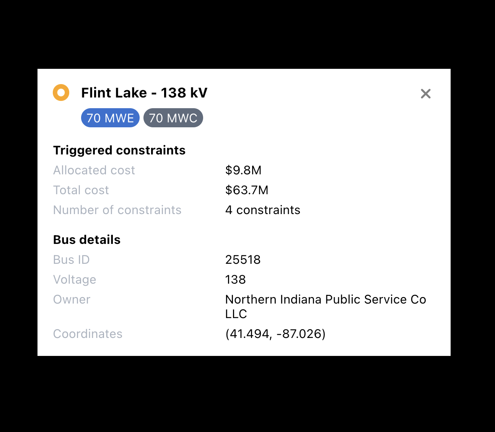

## Instructions

1. Clone / download repo
2. Navigate to project directory
3. `npm install` to install dependencies
4. `npm start` to run the app
5. Open http://localhost:3000 to view website

## Expected result

Should display a centered `BusDetail` component on a black background as shown below

